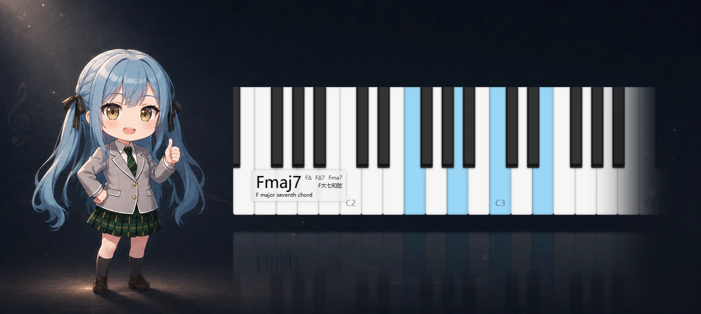
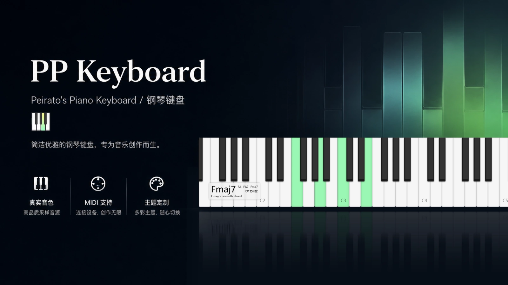
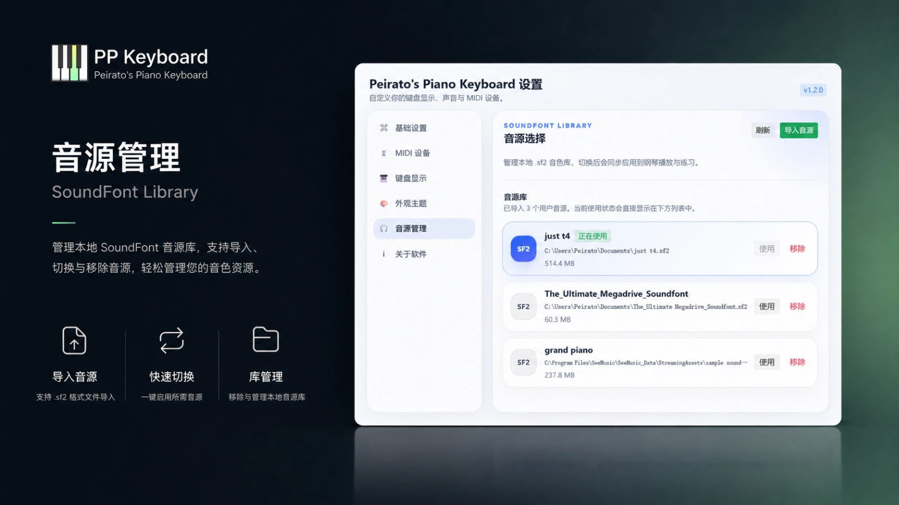
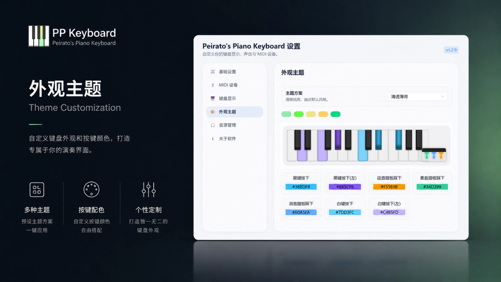
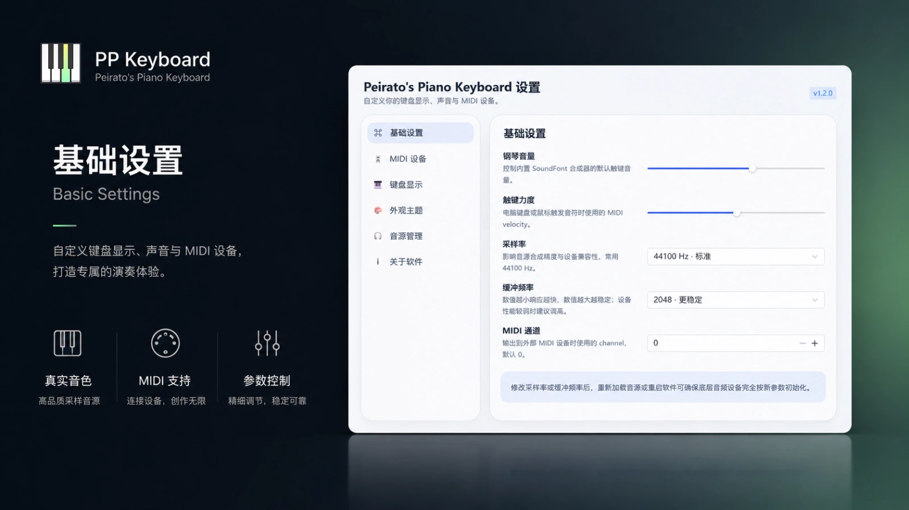
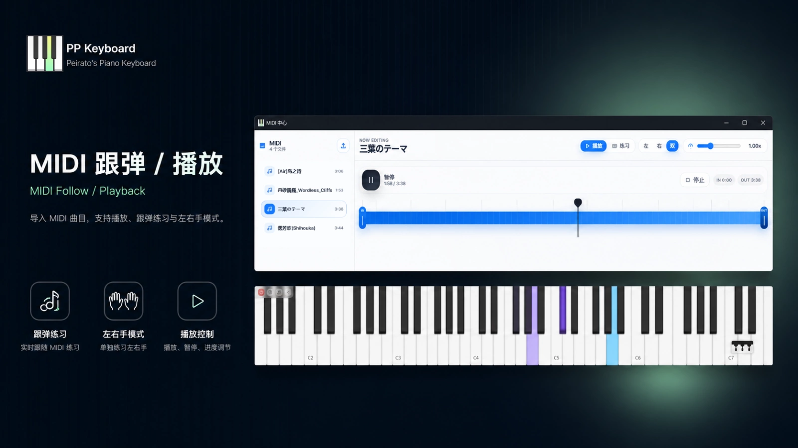
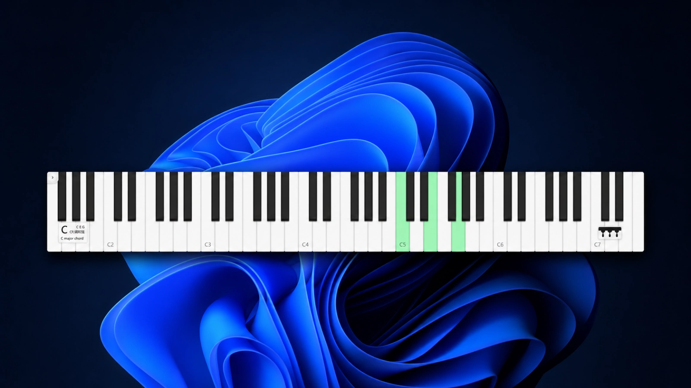

<p align="center">
  
</p>
<h1 align="center">🎹 Peirato's Piano Keyboard</h1>

<p align="center">
  一款基于 <b>Wails 3 + Vue 3 + Go</b> 构建的轻量级桌面钢琴键盘。  
  支持 MIDI 键盘、电脑键盘、鼠标演奏、SF2 音源、MIDI 播放预览与跟弹练习。
</p>

<p align="center">
  <a href="https://github.com/Peiratooo/Peirato-s-Piano/releases">下载 Release</a>
  ·
  <a href="./docs/ARCHITECTURE.md">架构文档</a>
  ·
  <a href="#-从源码运行">从源码运行</a>
</p>

---

## ✨ 项目简介

**Peirato's Piano** 是一个挂在桌面上的迷你钢琴键盘工具，目标不是做成全屏式教学软件，而是提供一个可以长期停留在桌面边缘的小型演奏 / 练习面板。

它适合这些场景：

- 外接 MIDI 键盘时，作为桌面可视化键盘使用；
- 没有 MIDI 键盘时，直接用电脑打字键盘或鼠标演奏；
- 加载 MIDI 文件后，进行预览播放、区间播放和左右手跟弹练习；
- 使用自定义 SF2 音源，让本地软件音色更贴近自己的偏好；
- 作为直播、录屏、教学或练琴时的键盘提示组件。

---

## 📸 预览

### 产品概览



### 桌面键盘


### 功能展示

| 音源管理 | 外观主题 |
| --- | --- |
|  |  |

| 基础设置 | MIDI 跟弹 / 播放 |
| --- | --- |
|  |  |

### 桌面悬浮视觉



---

## 🚀 功能特性

### 🎹 桌面钢琴键盘

- 轻量长条状键盘界面，适合悬浮在桌面、直播画面或教学录屏中；
- 支持白键 / 黑键实时高亮，按下、松开、延音状态都能同步反馈；
- 支持和弦名称识别，当前按下的组合音会自动显示为和弦；
- 支持电脑键盘、鼠标点击 / 滑动和外接 MIDI 键盘演奏。

### 🎛 MIDI 输入 / 输出

- 自动扫描 MIDI 输入设备和输出设备；
- 支持切换输入设备，连接外部 MIDI 键盘进行演奏；
- 支持软件内置音源或外部 MIDI 输出设备；
- 支持延音踏板、柔音踏板、持音踏板等常见控制消息；
- 提供一键 All Notes Off，避免卡音或残留高亮。

### 🎶 SF2 音源管理

- 内置默认钢琴音源，可开箱即用；
- 支持导入 `.sf2` SoundFont 音源；
- 支持切换、重载、移除和恢复默认音源；
- 音量、采样率、缓冲等音频参数可在设置中心统一管理。

### 🎼 MIDI 播放预览

- 支持导入 MIDI 文件并解析曲目信息、音符、轨道和速度；
- 支持播放、暂停、停止、拖动进度和变速播放；
- 播放时键盘会同步高亮当前音符；
- 支持区间锚点，可只播放选中的练习范围；
- MIDI 目录保存系统绝对路径，重新打开软件后可以继续加载历史曲目；
- 重复路径不会重复导入，路径失效时会提示用户清理记录。

### 🧩 跟弹练习模式

- MIDI 播放 / 练习已独立为一个长条状窗口，主键盘和练习控制互不挤占；
- 支持左手练习、右手练习、双手练习；
- 支持根据轨道和音高推断左右手声部；
- 跟弹时练习声部静音，非练习声部可自动伴奏；
- 当前需要按下的音会在键盘上显示提示；
- 用户按对当前步骤后自动进入下一步；
- 短时间内接近的琶音 / 和弦会合并显示，减少“一个音一个音跳”的割裂感。

### 🎨 外观与主题

- 支持自定义主题颜色；
- 支持白键、黑键、左右手、踏板等不同状态的颜色配置；
- 提供多组预设颜色方案，方便快速切换风格；
- 设置中心采用独立窗口，减少主界面占用。

### 🪟 多窗口同步

- 主钢琴窗口、设置中心窗口、MIDI 播放 / 练习窗口互相独立；
- 后端通过 Wails Event 推送设备、按键、播放状态；
- 前端窗口间通过 BroadcastChannel / localStorage 进行同步；
- 播放高亮、跟弹提示、错键提示和清理状态可以跨窗口同步。

---

## 📦 安装

### 下载 Release

前往 [Releases](https://github.com/Peiratooo/Peirato-s-Piano/releases) 下载对应系统的安装包或压缩包，解压 / 安装后运行即可。

> macOS 首次打开时，如果系统提示无法验证开发者，可以在「系统设置 → 隐私与安全性」中允许打开，或在 Finder 中右键应用选择「打开」。

---

## 🧑‍💻 从源码运行

### 环境要求

- Go
- Node.js
- Wails 3
- 支持 MIDI 的系统环境

### 克隆项目

```bash
git clone https://github.com/Peiratooo/Peirato-s-Piano.git
cd Peirato-s-Piano
```

### 安装前端依赖

```bash
cd frontend
npm install
cd ..
```

### 同步 Go 依赖

```bash
go mod tidy
```

### 开发模式

```bash
wails3 dev
```

或使用项目任务：

```bash
wails3 task dev
```

### 构建发布版本

```bash
wails3 task release
```

构建产物通常会输出到 `bin/` 目录，具体路径以当前 Wails 配置为准。

---

## 🕹 使用说明

### 1. 使用电脑键盘演奏

打开软件后，可以直接按下电脑键盘中映射到钢琴音符的按键。按下时对应琴键会亮起，松开后恢复。

### 2. 使用 MIDI 键盘演奏

进入设置中心，选择 MIDI 输入设备。连接成功后，外部 MIDI 键盘的 Note On / Note Off 会同步触发软件音源和前端高亮。

### 3. 切换输出方式

在设置中心选择输出目标：

- 无：只显示按键，不发声；
- 软件音源：使用内置或自定义 SF2 音源发声；
- 外部 MIDI 输出：将演奏消息发送到外部 MIDI 设备或虚拟端口。

### 4. 管理音源

在音源管理页面导入 `.sf2` 文件后，可以选择该音源作为当前软件音源。加载失败时，软件仍可继续运行，只是内置发声不可用。

### 5. MIDI 播放 / 跟弹

打开 MIDI 播放 / 练习窗口后：

1. 导入一个 MIDI 文件；
2. 在左侧目录选择曲目；
3. 使用播放控制区预览 MIDI；
4. 调整左右锚点选择练习区间；
5. 切换到跟弹模式；
6. 选择左手、右手或双手练习；
7. 根据键盘提示按下对应音符，完成当前步骤后自动继续。

---

## 🧭 项目架构

详细启动流程、服务职责、MIDI 设备监听、音源渲染、MIDI 文件解析、跟弹练习和多窗口同步逻辑，请查看：

[docs/ARCHITECTURE.md](./docs/ARCHITECTURE.md)

核心模块概览：

```text
main.go                         程序入口
service/app.go                  Wails 应用与窗口创建
service/config.go               用户配置读取、合并与保存
service/piano.go                MIDI 设备扫描、监听与演奏入口
service/soundfont.go            SF2 音源加载与实时渲染
service/midi_file.go            MIDI 文件解析与跟弹计划生成
service/playback.go             MIDI 预览播放调度
frontend/src/views/MainWindow.vue       主钢琴窗口
frontend/src/views/ControlCenterWindow.vue 设置中心窗口
frontend/src/views/MidiWindow.vue       MIDI 播放 / 跟弹窗口
frontend/src/services/windowBus.js      多窗口前端同步
frontend/src/store/index.js             Pinia 状态中心
```

---

## 🛠 常见问题

### MIDI 设备没有出现

可以尝试：

1. 重新插拔 MIDI 设备；
2. 确认设备没有被其他软件独占；
3. 在设置中心重新选择输入设备；
4. 重启软件后再次检查设备列表。

### 软件没有声音

可以检查：

1. 输出目标是否选择了「软件音源」；
2. 当前 SF2 音源是否加载成功；
3. 系统音量和应用音量是否被静音；
4. 如果使用外部 MIDI 输出，确认外部设备或虚拟端口是否正常发声。

### 播放后出现卡音

可以点击停止或 All Notes Off。软件会向内置音源、外部 MIDI 输出和前端键盘状态同时发送清理指令。

---

## 💡 致谢

- [Wails](https://wails.io/) — 跨平台桌面应用框架；
- [Vue.js](https://vuejs.org/) — 前端框架；
- Go MIDI / SoundFont 生态中的开源项目；
- 所有提出建议、反馈问题和愿意使用这个小工具的朋友。

<p align="center">
  如果这个项目对你有帮助，欢迎点一个 ⭐ Star 支持一下。
</p>
